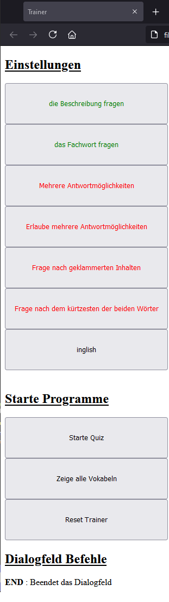

# Vocabulary-trainer
A vocabulary trainer that can import vocabulary from Quizlet. 

## How to download vocabulary
Quizlet or pdf files save the vocabulary in tables. If you copy them with a right click they will be placed in the clipboard in the following format:

<b>1aaa</b> 
<b>1bbb</b> 
 
<b>2aaa</b> 
<b>2bbb</b> 
 
<b>3aaa</b> 
<b>3bbb</b> 

When you start the Python file you can copy the clipboard into it. Web scraping would certainly be more convenient, but unfortunately it is forbidden.
A further description of the settings is stored in the program.

## Supported languages
- English
- German